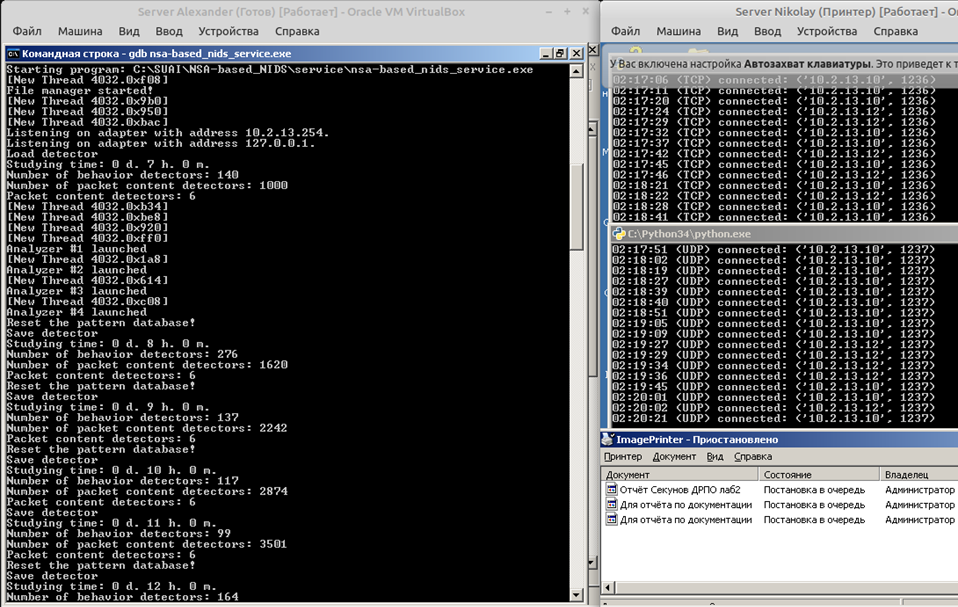
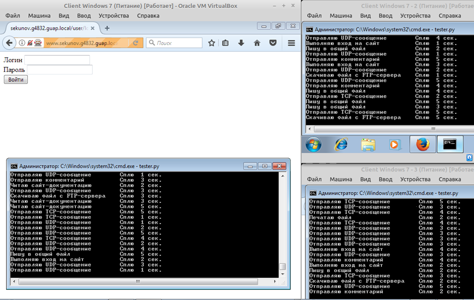
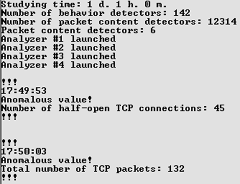
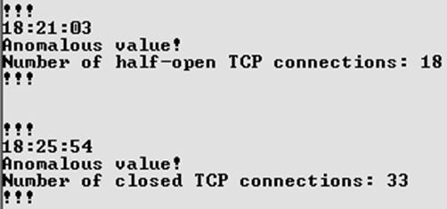
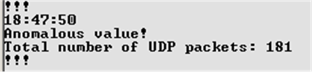
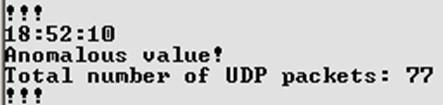
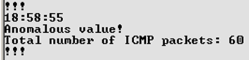
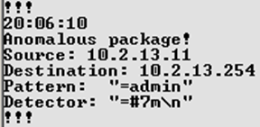

# NSA-based_NIDS
Сетевая система обнаружения вторжений (ССОВ, NIDS) на основе алгоритма отрицательного отбора (АОО, NSA)

## Описание
Техническая особенность прототипа:
* работает только в ОС Windows; 
* анализ трафика сети осуществляется с помощью библиотеки winsock2;
* настройка работы выполняется редактирование файла "config.ini";
* формирует базу детекторов, которые сохраняются в файлах "detectors [Nd Nh Nm].dat" (N - время потраченное на обучение);
* выполнят логирование в файл "&lt;ip-адрес адптера&gt;.log";
* сборка проекта осуществляется посредством вызова утилиты make.

Для проверки пакетов трафика сети используются две модификации АОО:
* С бинарным кодированием, содержимое пакета делится на фрагменты со скользящего окном, которые сравниваются с детекторами, вычисляя расстояние по Хэммингу для определения уровня похожести строк. В качестве детекторов выступают случайные строки, которые не похожи на фрагменты "безопасного" трафика.
* С вещественным кодированием, через заданный промежуток времени формируется вектор статистики, который добавляется в структуру данных KD-дерева, который разделяет пространство на области "безопасных" и "аномальных" данных. В данной реализации вектор состоит из следующих полей: 
1. общее количество пакетов TCP;
2. общее количество пакетов UDP;
3. общее количество пакетов ICMP;
4. общее количество пакетов других протоколов;
5. количество полуоткрытых соединений TCP (пакеты с флагом SYN);
6. количество открытых соединений TCP (пакеты с флагом ASK, отправленные как ответ на SYN+ASK получателя);
7. количество закрытых соединений TCP (пакеты с флагом FIN);
8. количество сброшенных соединений TCP (пакеты с флагом RST);
9. количество обращений к разрешенным портам TCP;
10.	количество обращений к неразрешенным портам TCP;
11.	количество обращений к разрешенным портам UDP;
12.	количество обращений к неразрешенным портам UDP.

## Пример работы
Для проверки работы использовалась сеть из виртуальных машин (2 сервера на ОС Windows Server 2003 и 3 клиента на ОС Windows 7):  
  

Для осуществления имитации активности, на клиентских машинах использовался скрипт Python, который позволил автоматизировать ряд действий:
1.	программное отправление TCP сообщения на заданный сервер;
2.	программное отправление UDP сообщения на заданный сервер;
3.	пролистывание сайта-документации (статичные html) через браузер;
4.	заполнение и отправка комментариев на форме в браузере;
5.	осуществление входа на сайт с помощью браузера;
6.	редактирования файла в общей синхронизирующийся (DFS) папке;
7.	программное скачивание файла, путем обращения к FTP-серверу;
8.	отправка файла (отчёта docx) на печать.
Действия выполнялись случайно, в пределах 1-5 секунд. 

Далее представлены скриншоты процесса обучения.

Состояние серверов на момент обучения (левая часть - прототип в процессе обучения детекторов, запущенном в отладчике gdb):  
  

Состояние клиентов на момент обучения:  
  

Для проверки детекторов (время обучения 25 часов) использовалась утилита hping3:  
1.	Для реализации DoS-атаки «TCP-SYN Flood» использовалась команда:  
```
hping3 -S 172.18.13.253 --rand-source -p 22 --faster
```
Сначала была реакция на большое количество не закрытых SYN пакетов, затем их заменило сообщение о превышенном значения общего количества TCP-пакетов.  
  
2.	Сканировано «TCP-SYN Scan» выполнялось командой:  
```
hping3 -S 172.18.13.253 --scan 80-90 -V
```
Получен схожий результат.  
Сканирование «FIN Scan» было отловлено успешно.  
Выполняемая команда:  
``` 
hping3 -F 172.18.13.253 --scan 80-90 -V
``` 
  

3.	Применение сканирования «ACK Scan» никаких результатов не дало, так как текущая реализация подсчитывает флаг ACK как признак успешного открытия соединения TCP. Команда:  
```
hping3 -R 172.18.13.253 --scan 80-90 -V
```
4. Dos-атака и сканирование по проколу UDP, выполнялись командами:
```
hping3 172.18.13.253 --udp --flood  
hping3 172.18.13.253 --udp --scan 80-90
```




5.	Для «Ping Scan» следующая команда выполняло посылку 30 ICMP-пакетов:
```
hping3 172.18.13.253 --icmp -c 30 --fast
```


6. В качестве аномалии в данных удалось отловить только слово admin, которое не присутствовало в процессе обучения.   
  
